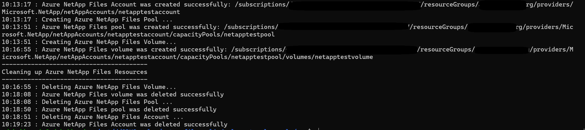

# Azure NetAppFiles script Sample - Dual-Protocol for Azure CLI 

This project demonstrates how to create a dual-protocol Volume (uses both SMB/NFSv3 protocol types) for Microsoft.NetApp resource provider using Azure CLI module.

In this sample application we perform the following operations:

* Creations
    * Azure NetApp Files Account
    * Capacity Pool
    * Dual-Protocol Volume
* Deletions
    * Dual-Protocol Volume
    * Capacity Pool
    * Azure NetApp Files Account

>Note: The cleanup execution is disabled by default. If you want to run this end to end with the cleanup, please
>change value of boolean variable 'SHOULD_CLEANUP' in create-anf-dual-protocol-volume.sh

If you don't already have a Microsoft Azure subscription, you can get a FREE trial account [here](http://go.microsoft.com/fwlink/?LinkId=330212).

## Prerequisites

1. Azure Subscription
1. Subscription needs to be enabled for Azure NetApp Files. For more information, please refer to [this](https://docs.microsoft.com/azure/azure-netapp-files/azure-netapp-files-register#waitlist) document.
1. Resource Group created
1. Virtual Network with a delegated subnet to Microsoft.Netapp/volumes resource. For more information, please refer to [Guidelines for Azure NetApp Files network planning](https://docs.microsoft.com/en-us/azure/azure-netapp-files/azure-netapp-files-network-topologies)
1. Make sure [Azure CLI](https://docs.microsoft.com/cli/azure/install-azure-cli) is installed.
1. Windows with WSL enabled (Windows Subsystem for Linux) or Linux to run the script. This was developed/tested on Ubuntu 18.04 LTS (bash version 4.4.20).
1. Make sure [jq](https://stedolan.github.io/jq/) package is installed before executing this script.

# What is netappfiles-cli-pool-change-sample doing? 

This sample is dedicated to demonstrate how to create a dual-protocol Volume using an ANF Account name in Azure NetApp Files.
Dual-protocol volumes use both SMB and NFS protocol types.
This project will first create an ANF Account with an Active Directory object using the Root CA certificate mentioned in the prerequisites section.
Then a capacity pool is created, and finally a single dual-protocol volume using Standard service level tier.

There is a section in the code dedicated to remove created resources. By default this script will not remove all created resources;
this behavior is controlled by a boolean variable called 'SHOULD_CLEANUP' in the create-anf-dual-protocol-volume.sh file. If you want to erase all resources right after the
creation operations, set this variable to 'true'.
If any of the earlier operations fail for any reason, the cleanup of resources will have to be done manually.

# How the project is structured

The following table describes all files within this solution:

| Folder      | FileName               				 | Description                                                                                                                         |
|-------------|--------------------------------------|-------------------------------------------------------------------------------------------------------------------------------------|
| Root        | create-anf-dual-protocol-volume.sh   | Authenticates and executes all operations                                                                                           |


# How to run the script

1. Clone it locally
    ```powershell
    git clone https://github.com/Azure-Samples/netappfiles-cli-dual-protocol-sample.git
    ```
1. Open a bash session and execute the following Run the script

	 * Change folder to **netappfiles-cli-dual-protocol-sample\src\**
	 * Open create-anf-dual-protocol-volume.sh and edit all the parameters
	 * Save and close
	 * Run the following command
	 ``` Terminal
	 ./create-anf-dual-protocol-volume.sh
	 ```

Sample output


# References

* [Create a dual-protocol volume](https://docs.microsoft.com/en-us/azure/azure-netapp-files/create-volumes-dual-protocol)
* [Resource limits for Azure NetApp Files](https://docs.microsoft.com/azure/azure-netapp-files/azure-netapp-files-resource-limits)
* [Azure Cloud Shell](https://docs.microsoft.com/azure/cloud-shell/quickstart)
* [Azure NetApp Files documentation](https://docs.microsoft.com/azure/azure-netapp-files/)
* [Download Azure SDKs](https://azure.microsoft.com/downloads/)
 
